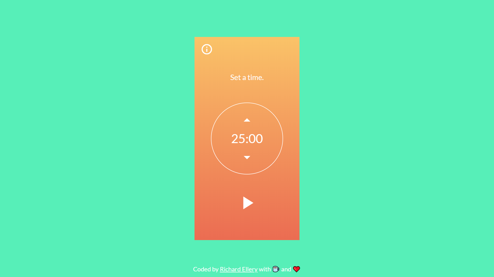
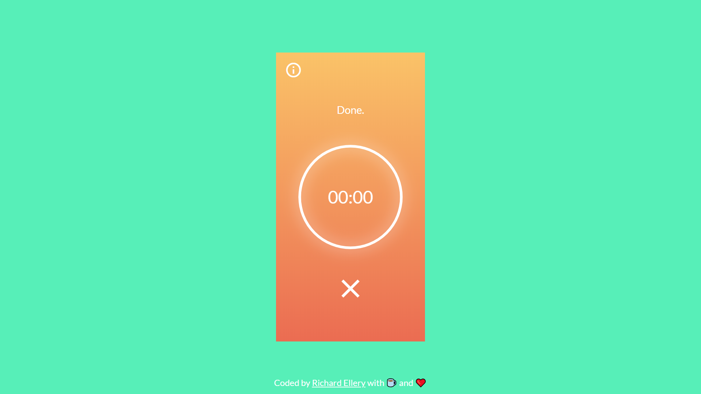
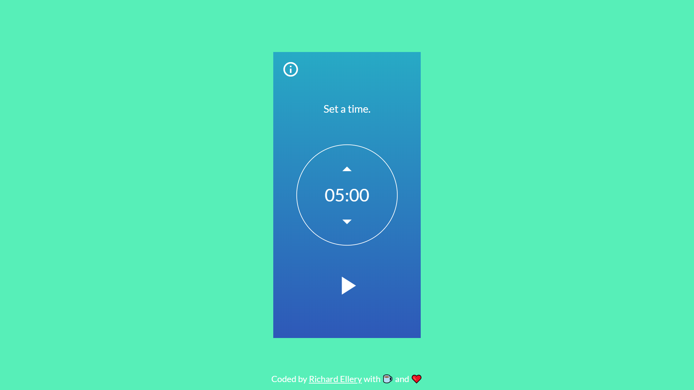
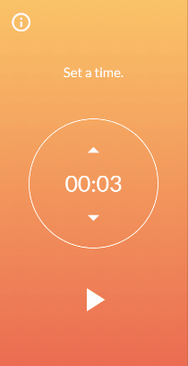
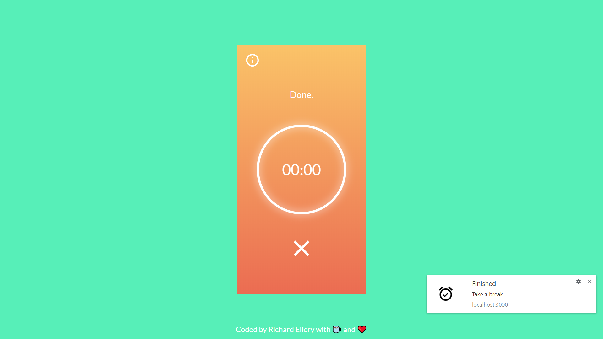

## Pomodoro Clock

This is a [pomodoro](https://francescocirillo.com/pages/pomodoro-technique) clock application, or a productivity timer. 

Check it out 👉[here](https://ellereeeee-pomodoro-clock.netlify.com/).

I wrote about some lessons I learned from coding this application on [Medium ](https://medium.com/@ellereeeee/lessons-learned-from-my-first-react-app-3c4ebb740399).

## Motivation

I created this for the freeCodeCamp [Pomodoro Clock assignment](https://learn.freecodecamp.org/front-end-libraries/front-end-libraries-projects/build-a-pomodoro-clock) and to practice coding in React. This is my first application written entirely by myself in React.

## Code Style

## Screenshots

## Tech Used

- HTML5
- CSS3
- React
- Git

## Features

Animate elements when they enter or leave the DOM with [react-transition-group](https://github.com/reactjs/react-transition-group).

Enable desktop notifications.

## How to Use

Allow notifications. Work for 25 minutes then rest for 5 minutes. Repeat 3 more times for a total of 2 hours, then take a 15 minute break. Repeat the whole cycle.

There is no pause button; part of the concept of the Pomodoro Technique is to commit oneself to working for a period of time.